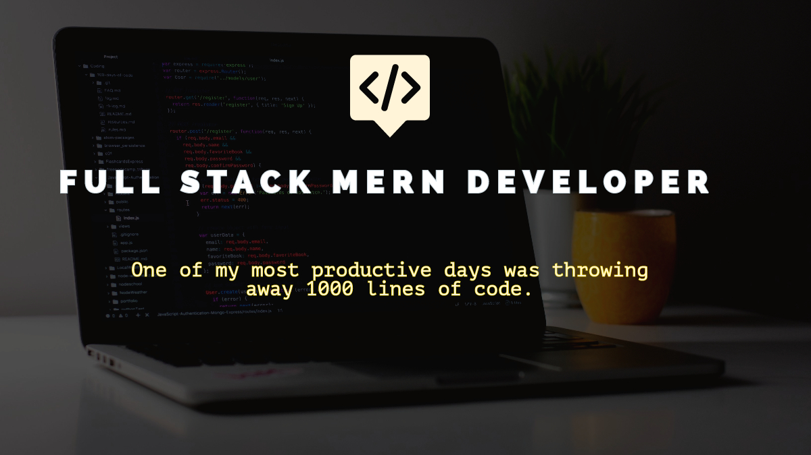

# 💫 About Me:
🔭 I’m currently working on Vigour Mania, A Health and Fitness Web App 👯 I’m looking to collaborate on ReactJS and NodeJS. 🤝 I’m looking for help with DSA 🌱 I’m currently learning Java  💬 Ask me about MERN Stack 

## 🌐 Socials:
 

 

# 💻 Tech Stack:
           
    

 
  
# 📊 GitHub Stats:

 

  
   
 

 

### 🔝 Top Contributed Repo

